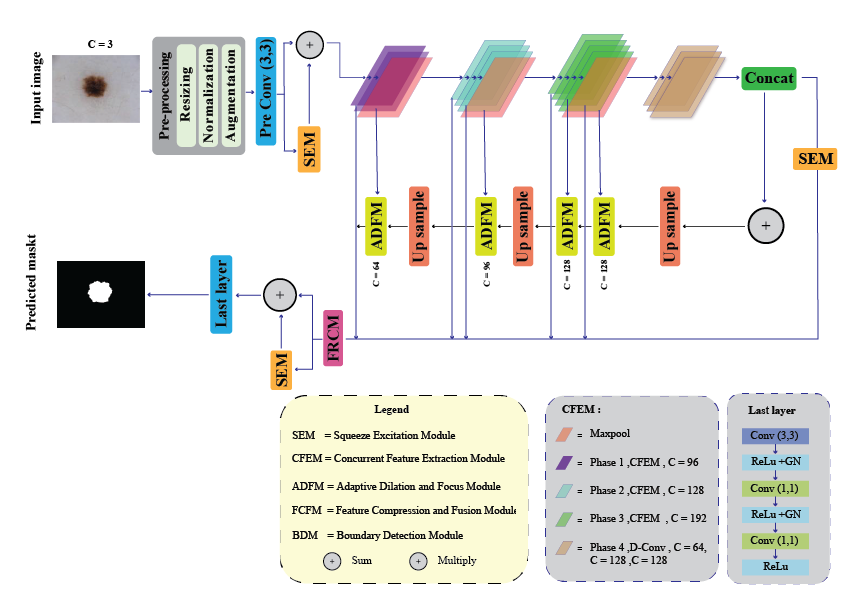

# EPA-Net: A Modular Attention Network for Skin Lesion Segmentation in Resource-Limited Clinical Settings

This is the official implementation of EPA-Net (Efficient Pyramid Attention Network), as introduced in the paper:

**"A Modular Attention Network for Skin Lesion Segmentation in Resource-Limited Clinical Settings"**

 **Submittied to:** [Cluster Computing]
 
 **Key Highlights:** 0.82M Parameters | 12.98 GFLOPs | 0.0333s Inference Time

EPA-Net is a novel modular framework designed to provide high-fidelity medical segmentation while remaining highly parameter-efficient (41x more efficient than H2Former), enabling AI-driven diagnosis on non-specialized hardware in rural or low-resource clinics.

---

## Architecture

EPA-Net achieves a balance between accuracy and efficiency through four specialized modules:

1. **Concurrent Feature Extraction Module (CFEM):** Maximizes usable features at each layer while minimizing network depth to enhance gradient flow.
2. **Boundary Detection Module (BDM):** A trainable, lightweight module that autonomously learns edge features using Difference of Gaussian (DoG) and Laplacian of Gaussian (LoG) operators without needing separate edge labels.
3. **Adaptive Dilation and Focus Module (ADFM):** Utilizes multi-scale dilated convolutions to focus on critical lesion characteristics without high computational cost.
4. **Feature Compression and Fusion Module (FCFM):** Combines multi-scale features to prevent spatial information loss during down-sampling.


---

## Performance Results

EPA-Net consistently outperforms state-of-the-art lightweight models across three public benchmarks.

### Quantitative Comparison

| Dataset | F1-Score | mIoU | Parameters | GFLOPs |
|---------|----------|------|------------|--------|
| ISIC-2017 | 0.8338 | 0.8230 | 0.82M | 12.98 |
| ISIC-2018 | 0.8674 | 0.8379 | 0.82M | 12.98 |
| PH2 | 0.9254 | 0.8578 | 0.82M | 12.98 |

*Data compiled from Tables 3, 4, and 5 of the manuscript*

### Qualitative Results

EPA-Net excels at defining complex lesion structures with sharper boundaries and improved fine details compared to other lightweight models.

---

## Quick Start

### 1. Requirements

- Python: 3.7.5
- PyTorch: 2.2.0
- OpenCV: 4.9.0
- NumPy: 1.26.4
- SciPy: 1.11.4
- Matplotlib: 3.8.0

### 2. Experimental Setup

- **Preprocessing:** Images and masks are scaled to $320 \times 320$ pixels.
- **Optimizer:** Adam with learning rate $1 \times 10^{-3}$ and weight decay $2 \times 10^{-4}$.
- **Loss Function:** Hybrid loss combining Binary Cross-Entropy (BCE), Dice, and IoU losses.

---

## 📁 Dataset Preparation

We employ three publicly available benchmarks for skin lesion segmentation: 

### Supported Datasets

1. **ISIC-2017 Segmentation Dataset**
   - 2,000 dermoscopic images with ground truth masks
   - [Download from ISIC Archive](https://challenge.isic-archive.com/data/)
   
2. **ISIC-2018 Task 1: Lesion Boundary Segmentation**
   - 3,694 dermoscopic images with pixel-level annotations
   - [Download from ISIC Archive](https://challenge.isic-archive.com/data/)
   
3. **PH2 Dataset**
   - 200 dermoscopic images from Pedro Hispano Hospital
   - [Download Link](https://www.fc.up.pt/addi/ph2%20database.html)

### Directory Structure

After downloading, organize the datasets as follows:

```
ULS-MSA/
├── data/
│   ├── ISIC2017/
│   │   ├── images/
│   │   └── masks/
│   ├── ISIC2018/
│   │   ├── images/
│   │   └── masks/
│   └── PH2/
│       ├── images/
│       └── masks/
├── models/
├── utils/
└── train.py
```
---

## Training

To train ULS-MSA on a specific dataset: 

```bash
# Train on ISIC-2017
python train.py --dataset ISIC2017 --epochs 100 --batch_size 16

# Train on ISIC-2018
python train.py --dataset ISIC2018 --epochs 100 --batch_size 16

# Train on PH2
python train.py --dataset PH2 --epochs 100 --batch_size 8
```

### Training Options
- `--dataset`: Dataset name (ISIC2017, ISIC2018, PH2)
- `--epochs`: Number of training epochs (default: 100)
- `--batch_size`: Batch size (default: 4)
- `--lr`: Learning rate (default: 0.001)
- `--save_path`: Path to save trained models

---

## Evaluation

To evaluate a trained model:

```bash
python evaluate.py --dataset ISIC2017 --model_path checkpoints/best_model.pth
```

This will compute:
- Mean Intersection over Union (mIoU)
- F1-Score (Dice Coefficient)
- Precision
- Recall
- Inference time per image

---


## Contact
**Razan Alharith** (Southwest Jiaotong University)  
Email: razanalharith@my.swjtu.edu.cn
