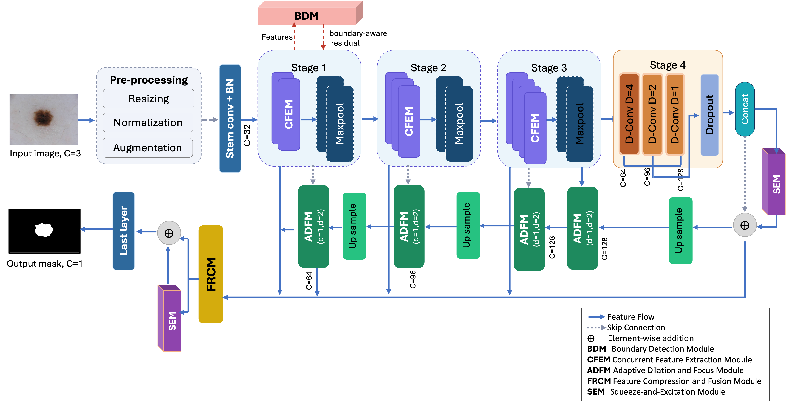

# EPA-Net: A Modular Attention Network for Skin Lesion Segmentation in Resource-Limited Clinical Settings

## Overview

EPA-Net (Efficient Pyramid Attention Network) is a modular encoder-decoder network for skin lesion segmentation that combines concurrent multi-path feature extraction, training-free boundary detection, dilated attention, and adaptive feature fusion — all within **0.82M Parameters | 12.98 GFLOPs | 0.0333s Inference Time**. EPA-Net achieves the highest F1-score and mIoU among all evaluated models on all three benchmarks, while being 41× more parameter-efficient than H2Former (33.7M) and 4.8× more efficient than EMCADNet-b0 (3.92M).

## Architecture



EPA-Net is built on a hierarchical encoder-decoder framework with an explicitly modular design: rather than using a single large mechanism, the segmentation task is divided into four sub-tasks, each handled by a dedicated lightweight module.

```
Input (320×320×3)
    ↓
Phase 1–3 (feature extraction):
    [CFEM → CFEM → CFEM] × 3 phases  (each CFEM embeds a BDM as one of 5 parallel paths)
    MaxPool after each phase
    ↓
Phase 4 (attention refinement):
    CFEM pairs + ADFM  (dilated depthwise conv d=1,2 → sigmoid gating)
    ↓
FCFM (multi-level compression):
    11× Conv1×1 → 2 channels → 3× Conv → Output mask
```

Nine CFEM instances are distributed across the first three phases (three per phase). The ADFM is instantiated four times. Dropout (25%) and L2 regularisation are applied throughout.

## Key Modules

**CFEM — Concurrent Feature Extraction Module**
Five parallel extractors operating simultaneously on the same input:
1. 1×1 conv — channel compression
2. 3×3 conv — local spatial features (texture, colour gradients)
3. 3×1 max-pool — object-scale information along one spatial dimension
4. 1×1 conv — channel-wise mixing of pooled features
5. BDM — boundary features (see below)

Outputs from the four non-boundary paths are combined via a residual connection, followed by a 3×3 conv for global fusion and a SEM for channel recalibration. The parallel design improves gradient flow and feature diversity without adding depth.

**BDM — Boundary Detection Module**
Embedded within each CFEM as one of its five paths. Processes input through:
- Gaussian blur (noise suppression) → DoG and LoG operators in parallel → element-wise multiplication (responses where both operators agree) → learnable 1×1 conv refinements per operator → 3×1 max-pool → 1×1 conv → residual → SEM

The fixed-weight DoG/LoG kernels add zero learnable parameters; the 1×1 conv layers adapt the edge responses to dataset-specific boundaries. Unlike ULS-Net's standalone BDM, here the BDM receives progressively refined features at each stage and adapts through training.

**ADFM — Adaptive Dilation and Focus Module**
Receives two inputs: CFEM pair output + previous layer output. Applies dilated depthwise convolutions at d=1 and d=2 in parallel (expanding receptive field without extra parameters), concatenates results, applies sigmoid to produce a pixel-wise attention map [0,1], and gates the CFEM features element-wise. Background regions are suppressed; diagnostically salient regions are emphasised. Followed by 3×1 max-pool + 1×1 conv refinement.

**FCFM — Feature Compression and Fusion Module**
Collects features from all early-stage CFEMs, the fourth-phase output, and the final ADFM. Progressively compresses to exactly 2 channels through 11× 1×1 convolutions (one channel per class — forced regularisation), then 3 additional convolutions produce the final segmentation output.

**SEM — Squeeze Excitation Module**
Channel attention used inside both CFEM and BDM: global average pooling → FC bottleneck (reduction ratio r) → sigmoid recalibration. Channel-only attention (not spatial) was chosen because spatial attention is already handled by ADFM's pixel-wise gating.

## Loss Function

Same composite loss as ULS-Net (BCE + Dice + IoU with α annealing):

$$\mathcal{L}_\text{total} = \mathcal{L}_\text{BCE} + \alpha(\mathcal{L}_\text{Dice} + \mathcal{L}_\text{IoU})$$

α initialised at 0.8, reduced by 0.2 every 70 epochs. All baselines trained under the same loss.

## Results

### ISIC-2017 and ISIC-2018

| Model | ISIC-2017 RC | ISIC-2017 PR | ISIC-2017 F1 | ISIC-2017 mIoU | ISIC-2018 RC | ISIC-2018 PR | ISIC-2018 F1 | ISIC-2018 mIoU | Params |
|-------|-------------|-------------|-------------|----------------|-------------|-------------|-------------|----------------|--------|
| H2Former | 0.8487 | 0.8582 | 0.8113 | 0.7984 | 0.9430 | 0.8290 | 0.8610 | 0.8207 | 33.7M |
| HED | 0.8027 | 0.8592 | 0.7781 | 0.7772 | 0.7956 | 0.9281 | 0.8155 | 0.8015 | 14.7M |
| EMCADNet-b0 | 0.8379 | 0.8620 | 0.8168 | 0.8081 | 0.9088 | 0.8652 | 0.8647 | 0.8314 | 3.92M |
| CMUNeXt | 0.8425 | 0.8629 | 0.8162 | 0.8034 | 0.8525 | 0.8860 | 0.8375 | 0.8134 | 3.15M |
| Rolling-UNet-S | 0.8562 | 0.8170 | 0.7874 | 0.7801 | 0.8689 | 0.8929 | 0.8508 | 0.8220 | 1.78M |
| UNeXt | 0.8323 | 0.8507 | 0.7932 | 0.7860 | 0.8723 | 0.8952 | 0.8563 | 0.8292 | 1.47M |
| ShuffleNetV2 | 0.8332 | 0.8519 | 0.8002 | 0.7899 | 0.8631 | 0.8982 | 0.8504 | 0.8256 | 1.38M |
| MobileNetV3 | 0.8061 | 0.9008 | 0.8142 | 0.8059 | 0.9142 | 0.8439 | 0.8523 | 0.8055 | 1.07M |
| **EPA-Net (ours)** | 0.8392 | 0.8928 | **0.8338** | **0.8230** | 0.9134 | 0.8657 | **0.8674** | **0.8379** | **0.82M** |

All baselines re-implemented from public source code and trained under the identical protocol.

### PH2

| Model | RC | PR | F1 | mIoU | Params |
|-------|----|----|----|----|--------|
| H2Former | 0.8885 | 0.9533 | 0.9144 | 0.8550 | 33.7M |
| HED | 0.9083 | 0.9233 | 0.9044 | 0.8524 | 14.71M |
| EMCADNet-b0 | 0.8216 | 0.6442 | 0.6396 | 0.5847 | 3.92M |
| CMUNeXt | 0.8912 | 0.9136 | 0.8873 | 0.8271 | 3.15M |
| Rolling-UNet-S | **0.9318** | 0.8930 | 0.9022 | 0.8383 | 1.78M |
| UNeXt | 0.8773 | **0.9536** | 0.9079 | 0.8514 | 1.47M |
| ShuffleNetV2 | 0.9020 | 0.9330 | 0.9080 | 0.8543 | 1.38M |
| MobileNetV3 | 0.8904 | 0.9071 | 0.8688 | 0.8277 | 1.07M |
| **EPA-Net (ours)** | 0.9315 | 0.9296 | **0.9254** | **0.8578** | **0.82M** |

EPA-Net achieves best F1 and mIoU across all three datasets. On PH2, it outperforms H2Former (33.7M) by +1.10 pp F1 at 41× fewer parameters.

### Model Complexity

| Model | Params (M) | FLOPs (G) | Time/Image (s) |
|-------|-----------|-----------|----------------|
| H2Former | 33.7 | 33.56 | 0.0259 |
| HED | 14.7 | 15.40 | **0.0048** |
| EMCADNet-b0 | 3.92 | 1286.62 | 0.0158 |
| CMUNeXt | 3.15 | 11.28 | 0.0079 |
| Rolling-UNet-S | 1.78 | 3.22 | 0.0268 |
| UNeXt | 1.47 | 872.14 | 0.0053 |
| ShuffleNetV2 | 1.38 | **2.20** | 0.0087 |
| MobileNetV3 | 1.07 | 262.80 | 0.0083 |
| **EPA-Net (ours)** | **0.82** | 12.98 | 0.0333 |

## Ablation Study

### Module Ablation (ISIC-2017)

| Variant | RC | PR | F1 | mIoU | Params | FLOPs (G) | Time/Image (s) |
|---------|----|----|----|----|--------|-----------|----------------|
| w/o BDM | 0.6396 | 0.6540 | 0.5037 | 0.5718 | 0.82M | 13.34 | 0.0820 |
| w/o ADFM | 0.6580 | 0.6256 | 0.5013 | 0.5676 | 0.90M | 11.32 | 0.0683 |
| w/o CFEM | 0.8333 | 0.8963 | 0.8334 | 0.8220 | 0.82M | 12.98 | 0.0322 |
| w/o DW | 0.8289 | 0.8901 | 0.8258 | 0.8159 | 1.10M | 19.96 | 0.0239 |
| **EPA-Net (full)** | **0.8392** | 0.8928 | **0.8338** | **0.8230** | **0.82M** | 12.98 | 0.0333 |

Removing BDM or ADFM causes catastrophic drops (F1 ~0.50): both are essential. Removing CFEM's parallel paths causes only a marginal drop, confirming a refinement-level contribution. Replacing depthwise with standard convolutions increases params by 34% and FLOPs by 54% while *reducing* accuracy, suggesting that depthwise convolutions act as regularisation on small training sets.

### Loss Function Ablation (ISIC-2017)

| Loss | RC | PR | F1 | mIoU |
|------|----|----|----|----|
| BCE only | 0.6396 | 0.6540 | 0.5037 | 0.5718 |
| BCE + Dice | 0.8258 | 0.8778 | 0.8159 | 0.8085 |
| BCE + IoU | 0.8239 | 0.8908 | 0.8237 | 0.8113 |
| **BCE + Dice + IoU** | **0.8392** | **0.8928** | **0.8338** | **0.8230** |

The three-component composite loss outperforms all two-component combinations. BCE alone fails due to class imbalance. Each loss provides a distinct gradient signal: BCE for pixel-level precision, Dice for region overlap, IoU for spatial alignment.

## Requirements

- Python ≥ 3.7.5
- PyTorch ≥ 2.2.0
- OpenCV ≥ 4.9.0
- NumPy ≥ 1.26.4
- SciPy ≥ 1.11.4
- Matplotlib ≥ 3.8.0
- NVIDIA GPU with 8 GB VRAM

```bash
pip install torch torchvision opencv-python numpy scipy matplotlib
```

## Training

```bash
python code/main.py \
  --mode train \
  --dataset ISIC2018 \
  --image_size 320 \
  --batch_size 2 \
  --num_epochs 100 \
  --lr 1e-3
```

## Testing

```bash
python code/main.py \
  --mode test \
  --dataset ISIC2018 \
  --image_size 320
```

## Datasets

| Dataset | Total | Train | Validation | Test |
|---------|-------|-------|-----------|------|
| ISIC-2017 | 2,000 | 1,250 | 150 | 600 |
| ISIC-2018 | 3,694 | 2,594 | 100 | 1,000 |
| PH2 | 200 | 140 | 20 | 40 |

All images resized to 320×320. Ground-truth masks binarised at threshold 0.8.

## Citation

If you use this code in your research, please cite:

```bibtex
@misc{alharith2025epanet,
  title   = {{EPA-Net}: A Modular Attention Network for Skin Lesion
             Segmentation in Resource-Limited Clinical Settings},
  author  = {Alharith, Razan},
  year    = {2025},
  url     = {https://github.com/razanharith/EPA-Net}
}
```

## Contact

For questions about this research, contact Razan Alharith at razanalharith@my.swjtu.edu.cn.
